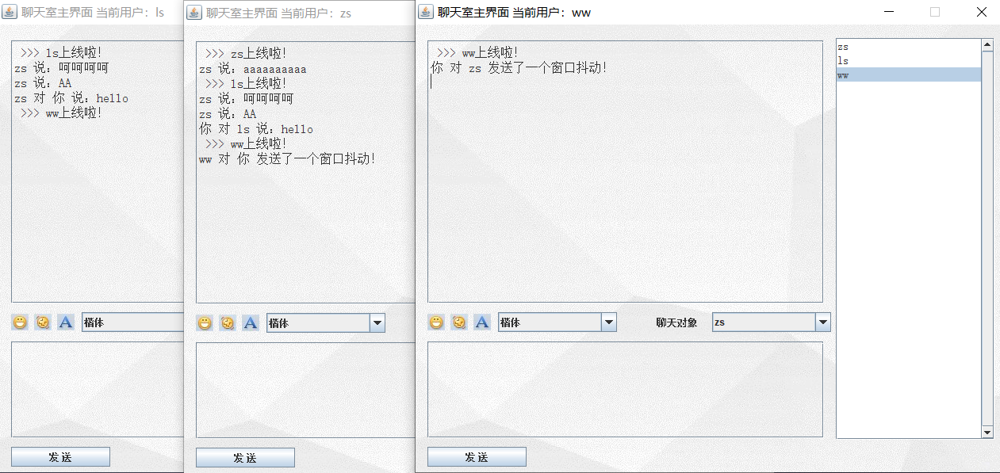
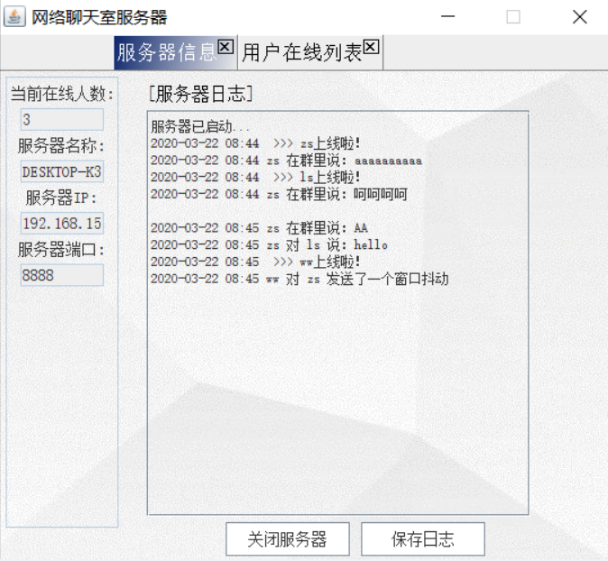
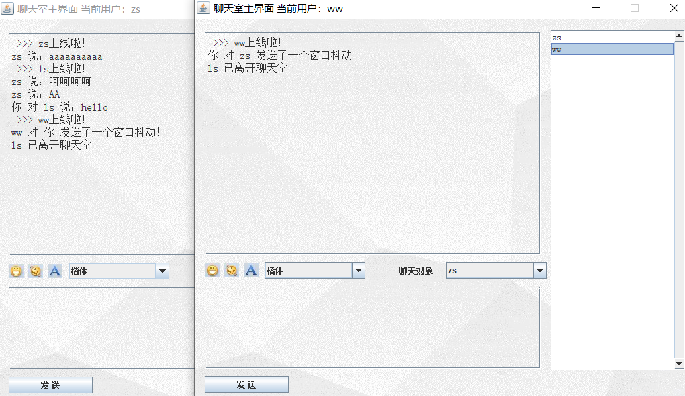

# 网络聊天室
基于Swing+JavaSE中的socket、多线程、I/O流实现的简单的网络多人聊天室。

支持群聊、私聊，窗口抖动、上下线提醒，日志记录等。

运行方法：

1. 运行cn.ncu.chat.server.ChatServer这个类，打开服务器；
2. 运行cn.ncu.chat.client.LoginFrame这个类，开启一个客户端，可以反复运行这个类，这样就可以开启多个客户端，实现多用户聊天了。

